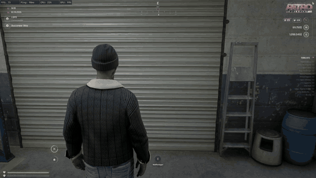

# Phone Overlay

Zeigt in OBS ein Overlay, sobald das Telefon in FiveM geöffnet ist.
`detect.py` erkennt das Telefon per Screen-Capture und meldet es an einen lokalen Server, der das Overlay per SSE an OBS schickt.

## Vorschau

Klick auf das Bild öffnet das Video in voller Qualität auf [Streamable](https://streamable.com/dak1h0).

## Voraussetzungen

- Node.js (`winget install OpenJS.NodeJS.LTS`)
- Python 3 (`winget install Python.Python.3.12`)
- Python-Pakete: `python -m pip install opencv-python mss numpy`

Alles davon installiert `ANFORDERUNGEN PRUEFEN.bat` automatisch, falls es fehlt.
Wurde etwas neu installiert, die Datei danach noch einmal starten.

## Starten

1. `OVERLAY STARTEN.bat` doppelklicken. Sie startet den Server (minimiert) und die Erkennung.
2. In OBS eine Browserquelle mit der URL `http://localhost:3981` hinzufügen.
3. Telefon im Spiel öffnen und schließen. Im Fenster erscheint `Telefon AN` bzw. `Telefon AUS`.

Zum Beenden das Fenster schließen oder Strg+C drücken. Der Server wird dabei mitbeendet.

## Dateien (Ordner `overlay`)

| Datei | Zweck |
|---|---|
| `detect.py` | Erkennt das Telefon per Template-Matching und meldet den Zustand an den Server |
| `server.js` | Lokaler Server auf Port 3981, liefert das Overlay aus und verteilt AN/AUS per SSE |
| `index.html` | Das Overlay für die OBS-Browserquelle. Eigenes Bild: `phone.png` in diesen Ordner legen |
| `template.png` | Ausschnitt vom Telefon (Dynamic Island + oberer Rahmen), nach dem gesucht wird |
| `snapshot.bat` | Macht einen Screenshot, um eine neue `template.png` zu erstellen |

## Eigenes Bild im Overlay

1. Das Bild als `phone.png` benennen.
2. In den Ordner `overlay` legen, neben `index.html`.
3. In OBS die Browserquelle aktualisieren (Rechtsklick auf die Quelle, Eigenschaften, „Cache der aktuellen Seite aktualisieren“).

Das Bild wird auf die Telefonfläche (260×500 px) zugeschnitten (`cover`). Am besten passt ein Hochformat im Verhältnis von etwa 1:2.
Ohne `phone.png` zeigt das Overlay nur ein graues Feld mit 📱.
Größe und Position lassen sich in `index.html` im `#phone`-Block anpassen.

## Einstellungen in `detect.py`

| Wert | Bedeutung |
|---|---|
| `MONITOR` | Welcher Monitor erfasst wird (1 = Hauptmonitor). Aktuell 2 |
| `REGION` | Bildbereich, der geprüft wird (schneller und genauer). Aktuell das rechte Viertel von Monitor 2. `None` = ganzer Monitor |
| `THRESHOLD` | Ab welchem Score das Telefon als sichtbar gilt (0–1, höher = strenger). Aktuell 0.92 |
| `INTERVAL` | Sekunden zwischen den Prüfungen. Aktuell 0.05 |
| `CONFIRM` | So viele gleiche Ergebnisse in Folge sind nötig, gegen Flackern |

`REGION` verwendet Koordinaten des gesamten virtuellen Desktops, nicht des einzelnen Monitors.
Monitor 2 beginnt zum Beispiel bei `left: 2560`.

## Neue template.png erstellen

1. `overlay\snapshot.bat` starten und innerhalb von 5 Sekunden das Telefon im Spiel öffnen.
2. Aus der entstandenen `screenshot.png` einen Teil ausschneiden, der in jeder Ansicht gleich aussieht (Rahmen, Dynamic Island). Keine Uhrzeit, kein Lockscreen.
3. Als `template.png` im Ordner `overlay` speichern. `screenshot.png` kann danach gelöscht werden.

## Fehlersuche

- **`node` / `python` nicht gefunden:** Installieren, danach alle Terminal-Fenster schließen und neu öffnen.
- **`template.png fehlt`:** Siehe „Neue template.png erstellen“.
- **Overlay geht nicht an:** Scores im Fenster ansehen. Bei offenem Telefon sollten sie klar über `THRESHOLD` liegen. Außerdem `MONITOR` und `REGION` prüfen.
- **Overlay flackert:** `THRESHOLD` oder `CONFIRM` erhöhen.
- **Server nicht erreichbar:** Läuft Port 3981 schon woanders? Dann Port in `server.js` und `detect.py` ändern.
